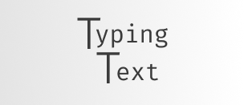
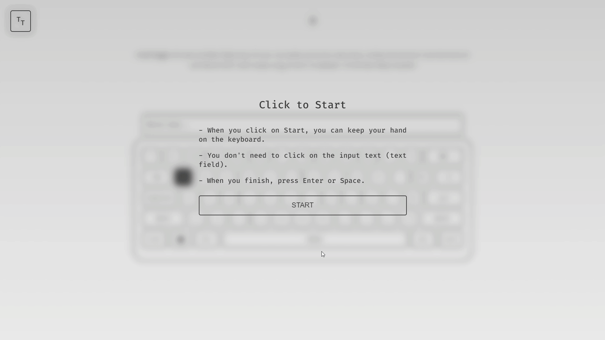
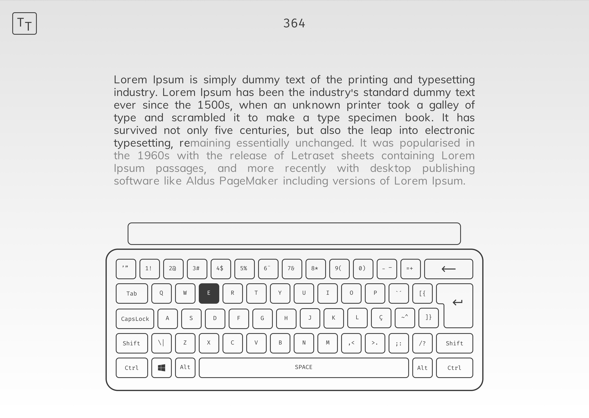
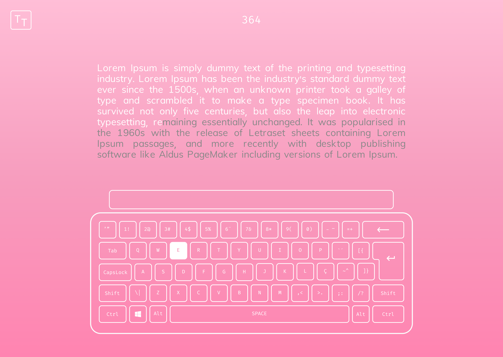

<div align="center">
  
</div>

<h6 align="center">A Typing Practice project to exercise your typing skills</h6>

# 

<div align="center">
  
</div>

# :computer: Technologies

This project was made using the follow technologies:

* [Typescript](https://www.typescriptlang.org/)      
* [React](https://reactjs.org/)
* [Cookie](https://www.npmjs.com/package/react-cookie)
* [ChartJS](https://github.com/reactchartjs/react-chartjs-2)

# :rocket: Features

* Pomodoro timer.
* Exercise typing skills.
* Save data using cookies
* Chart to show results
* React Context 

#

<div align="center">
   
   
</div>

# :construction_worker: How to run
```bash
# Clone Repository
$ git clone https://github.com/FilipeDiasLima/TypingTest.git
```

### 💻 Run Web Project

```bash
# Install Dependencies
$ yarn install
# Run Aplication
$ yarn start
```
Go to http://localhost:3000/ to see the result.

# Thanks

Give a ⭐️ if this project helped you!
